# Production Architecture — CBIR Engine
**System design document with Mermaid diagrams — July 2026**

This document specifies the production architecture for the CBIR SaaS platform, consistent with the technology choices established in prior planning: FastAPI, PostgreSQL + pgvector, Qdrant (scaling to Milvus), Redis, SigLIP 2 + DINOv2, and Podman/Kubernetes.

---

## 1. High-Level System Overview

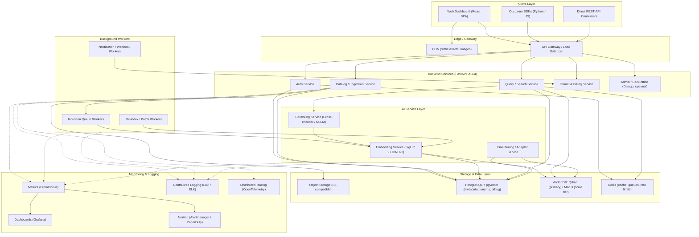

---

## 2. Frontend

### Responsibilities
- **Web Dashboard** (React SPA): tenant onboarding, catalog management UI, API key management, usage/cost dashboards, search playground for testing queries, fine-tuning feedback UI.
- **Customer SDKs**: thin client libraries (Python, JavaScript/TypeScript) wrapping the REST API for ingestion and query calls, handling auth token refresh and retries.
- **Direct API consumers**: customers integrating directly via REST/OpenAPI without an SDK.

### Design decisions
- Frontend is a separate deployable artifact from the backend (static SPA served via CDN), decoupled from API versioning.
- All frontend-to-backend communication goes through the API Gateway — the dashboard is just another API consumer, ensuring dogfooding of the same API surface customers use.
- Search playground in the dashboard calls the same `QuerySvc` endpoints as external customers, with no privileged internal-only path — keeps behavior consistent and testable.

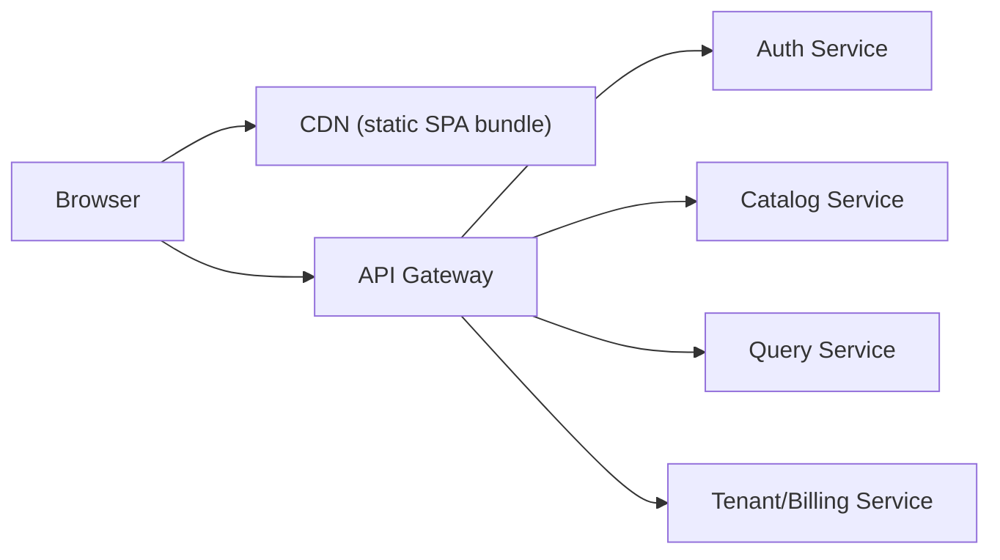

---

## 3. Backend

### Responsibilities
FastAPI-based ASGI services, split by domain rather than one monolith, so each can scale independently:

- **Auth Service**: API key issuance/rotation, session tokens, RBAC checks.
- **Catalog & Ingestion Service**: accepts uploads/manifests, triggers dedup, hands off to background workers, manages metadata CRUD.
- **Query/Search Service**: the core request path — accepts image/text/compositional queries, orchestrates embedding, vector search, filtering, and reranking, returns ranked results.
- **Tenant & Billing Service**: tenant lifecycle, usage metering, plan/quota enforcement.
- **Admin/Back-office** (optional, Django): internal tooling, catalog moderation, support workflows — kept separate from the customer-facing API so its heavier synchronous patterns don't affect query latency.

### Design decisions
- Services communicate internally via REST/gRPC; long-running work is handed off to queues rather than blocking a request.
- Query Service is the most latency-sensitive component — it is stateless and horizontally scaled independently of ingestion.
- All services are async (ASGI/Uvicorn workers) to handle the I/O-bound nature of calling embedding models, vector DBs, and rerankers without blocking.

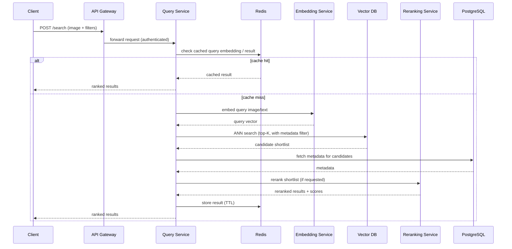

---

## 4. AI Service

### Responsibilities
- **Embedding Service**: hosts SigLIP 2 (primary, semantic + multilingual + text-image) and DINOv2 (secondary, structural/fine-grained) encoders; exposes an internal inference API; batches requests for throughput.
- **Reranking Service**: cross-encoder for straightforward reranking; MLLM-based reasoning reranker for compositional/complex queries; applied only to the top-K shortlist to control cost and latency.
- **Fine-Tuning/Adapter Service**: manages per-tenant LoRA-style adapters on top of base encoders; scheduled/batch retraining triggered by accumulated feedback, not real-time.

### Design decisions
- AI Service is deployed on GPU-backed node pools, separate from the CPU-bound API layer, and scaled independently based on inference queue depth.
- Embedding generation for ingestion is asynchronous and batched (10–30x throughput improvement over per-image inference); query-time embedding is synchronous but on a lightweight, low-latency path.
- Reranking is pluggable per NFR17 — tenants/query types can select cross-encoder-only (fast) or MLLM-based (slower, more precise) reranking.
- Per-tenant adapters are versioned artifacts stored alongside the base model, loaded dynamically at inference time rather than requiring separate model deployments per tenant.

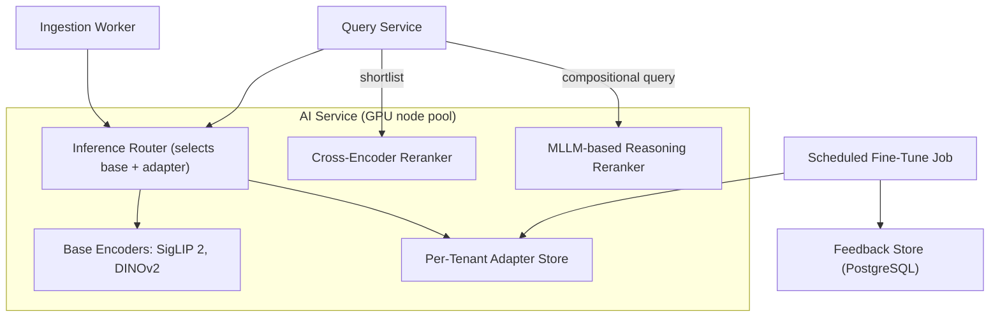

---

## 5. Storage

### Object Storage
- S3-compatible storage (AWS S3 / GCS / MinIO for self-hosted) for raw uploaded images and derived crops.
- Lifecycle policies for tiering/expiry aligned with tenant data-retention settings (NFR13).

### Relational Storage — PostgreSQL (+ pgvector, JSONB)
- System of record for tenants, users, API keys, billing, catalog item metadata, feedback/labels, and audit logs.
- JSONB columns for flexible per-tenant custom attributes.
- pgvector used for smaller tenant vector workloads (sub-10–50M vectors) where keeping vectors alongside relational metadata avoids a second system.

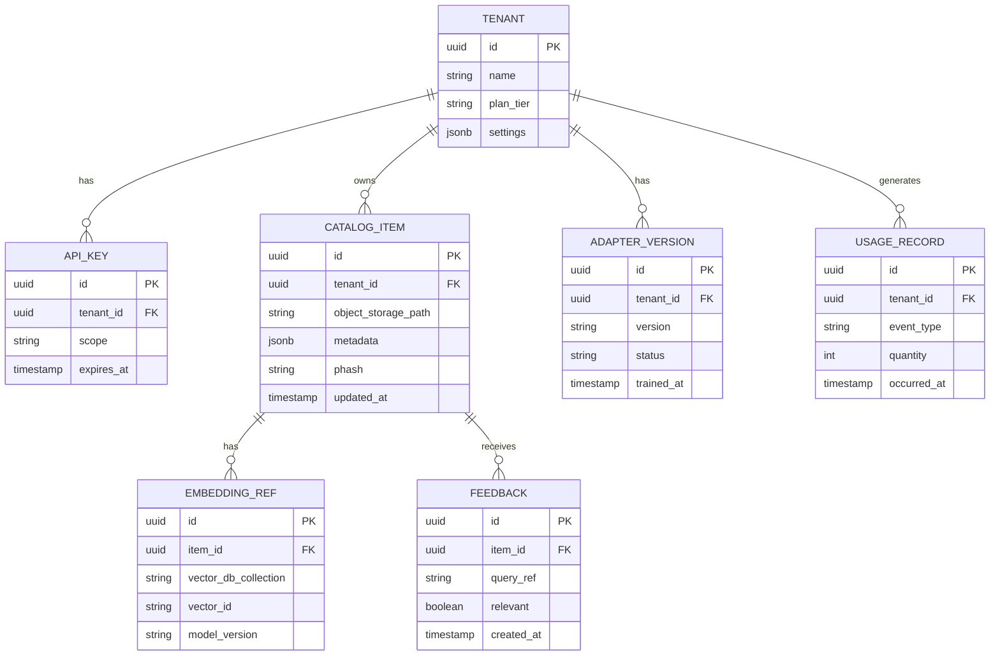

---

## 6. Vector Database

### Responsibilities
- Stores embeddings for fast approximate nearest-neighbor (ANN) recall at query time.
- **Qdrant** as the default per-tenant collection store (cost-efficient filtered search, low ops burden) for tenants under ~100M vectors.
- **Milvus/Zilliz** as the scale-out tier for tenants whose index grows past the several-hundred-million-vector range, using disaggregated storage/compute.

### Design decisions
- Each tenant's vectors live in an isolated collection/namespace (multi-tenancy support native to both Qdrant and Milvus) — no cross-tenant leakage.
- Metadata filters (category, price, availability) are stored as payload alongside vectors to support hybrid search in a single query.
- A tenant migration path (Qdrant → Milvus) is a defined operational runbook, not an ad hoc process, triggered by index size/query-load thresholds (NFR7).

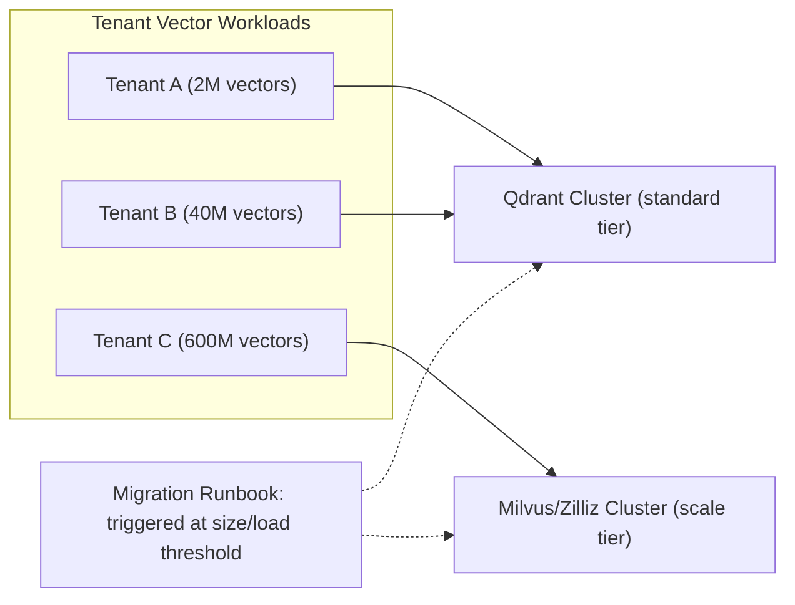

---

## 7. Authentication

### Responsibilities
- API key issuance/rotation/scoping for programmatic access (primary auth mode for the CBIR API).
- Session-based auth (OAuth2 / OIDC-compatible) for the web dashboard.
- Role-based access control within a tenant account (admin, developer, read-only, billing) — post-MVP per PRD, but architected for from day one.

### Design decisions
- Auth Service issues short-lived signed tokens (JWT) validated at the API Gateway before requests reach backend services — backend services trust the gateway's validation rather than re-implementing auth logic per service.
- API keys are hashed at rest; rotation invalidates old keys after a grace period to avoid breaking in-flight integrations.
- Rate limits (NFR4, FR4.4) are enforced at the gateway using Redis-backed counters, keyed by API key/tenant.

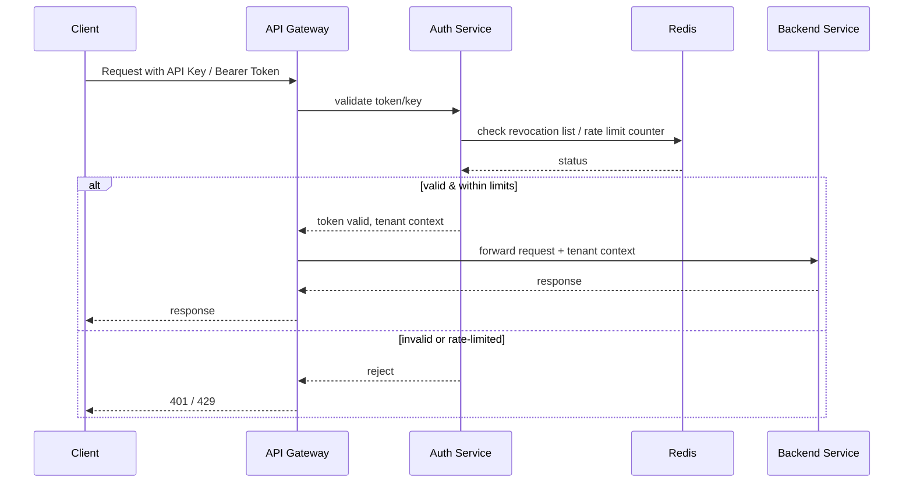

---

## 8. Background Workers

### Responsibilities
- **Ingestion Queue Workers**: consume newly uploaded images, run dedup/crop, call the Embedding Service, write to the Vector DB and PostgreSQL.
- **Re-index/Batch Workers**: handle full or partial catalog re-indexing, model version migrations, and scheduled fine-tune jobs.
- **Notification/Webhook Workers**: deliver async events (indexing complete, high-confidence brand-protection match found) to tenant-configured endpoints.

### Design decisions
- Redis-backed task queue (e.g., a Celery/RQ-style worker pool) decouples ingestion latency from the customer-facing upload API response — uploads return immediately with a job reference; embedding happens asynchronously (FR1.4).
- Workers scale independently and horizontally based on queue depth, separate from the query-serving path so ingestion spikes never degrade search latency.
- Failed jobs are retried with backoff and routed to a dead-letter queue for manual inspection, with alerting on dead-letter growth.

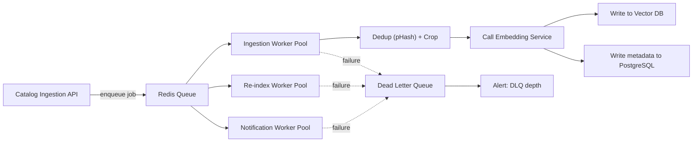

---

## 9. Caching

### Responsibilities
- Redis serves three distinct roles: **query/result cache**, **task queue backend**, and **rate-limit/session store**.

### Design decisions
- Query embedding cache: identical query images/text hash to the same cache key, skipping redundant encoder inference.
- Result cache: full ranked-result payloads cached with a short TTL for popular/repeated queries.
- **Cache invalidation on re-index is a first-class requirement**: any write to an item's embedding or metadata triggers invalidation of cache entries referencing that item's collection/tenant, not just a passive TTL expiry.
- Redis Cluster for horizontal scaling and replication to avoid a single point of failure.

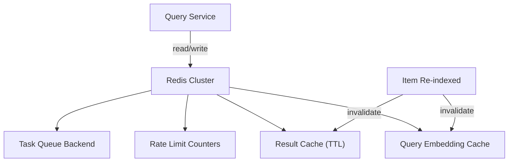

---

## 10. Deployment

### Responsibilities
- Kubernetes-based deployment across separate node pools: CPU pool (API services, workers), GPU pool (AI service), and managed data services (PostgreSQL, Redis, Vector DB — self-hosted or managed depending on tier).
- Podman used for building OCI-compliant images in CI/CD; runtime is standard Kubernetes (containerd), independent of the build tool.
- Blue/green or canary deployment strategy for the Query Service specifically, given its latency-sensitivity and customer-facing SLA.

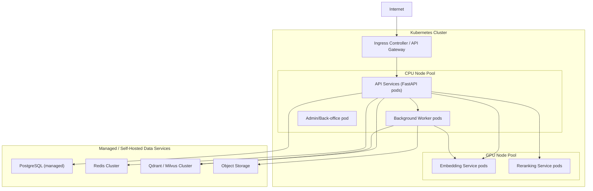

### 10.1 Addendum: Local-First Development Environment (added at Milestone 1)

The Kubernetes/GKE topology above is the **production deployment target**, prepared under `infra/` and
implemented for GCP (with AWS/Azure as reserved, documented sibling implementations — see
`infra/README.md`). It is **not** used for day-to-day development.

For local development (this project being a solo-developer, production-quality portfolio project), every
backing service in the diagram above is run instead via Docker Compose, on a single machine, with no cloud
account, credentials, or billing required:

| Production component (diagram above) | Local Docker Compose equivalent |
|---|---|
| PG (managed PostgreSQL) | `postgres` service — PostgreSQL + pgvector container |
| RedisCluster | `redis` service — single Redis container |
| VDBCluster (Qdrant/Milvus) | `qdrant` service — single Qdrant container |
| ObjStorage (S3-compatible) | `minio` service — MinIO container (S3 API-compatible) |
| APIpods / WorkerPods / EmbedPods / RerankPods | Individual service containers, added incrementally from Milestone 2 onward, joining the same Compose network |
| Ingress | Not present locally — services are reached directly on their published Compose ports during development |

This is possible without any application-code divergence between local and production because every
backing service is chosen specifically for speaking an open, portable protocol (Postgres wire protocol,
Redis protocol, the S3 API) rather than a cloud-proprietary API — see `docs/CLEAN_ARCHITECTURE.md` Section
10 for how the same dependency-inversion principle is enforced inside each service's own codebase. See the
root `README.md` and `infra/README.md` for the full local/production equivalence table and the Terraform
module-interface/provider-implementation pattern that keeps the production side cloud-agnostic.

---

## 11. Monitoring

### Responsibilities
- **Metrics**: Prometheus scrapes per-service metrics (latency percentiles, error rates, queue depth, GPU utilization, cache hit rate).
- **Dashboards**: Grafana dashboards per NFR targets — P95/P99 query latency, uptime, cost-per-1000-queries, ingestion throughput.
- **Distributed tracing**: OpenTelemetry traces a query request across Gateway → Query Service → Embedding → Vector DB → Reranker, to diagnose latency bottlenecks in the multi-hop request path.
- **Alerting**: Alertmanager/PagerDuty rules tied directly to NFR thresholds (e.g., P95 latency breach, uptime SLA risk, DLQ depth, GPU pool saturation).

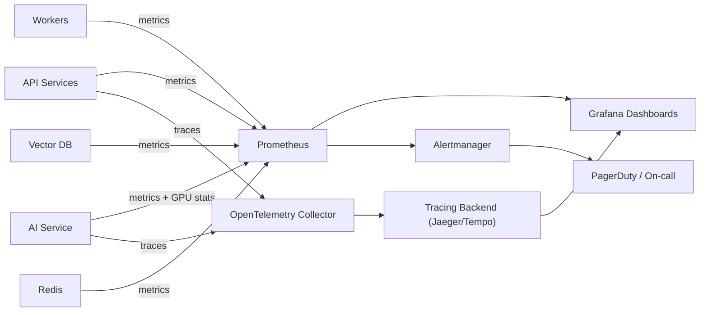

---

## 12. Logging

### Responsibilities
- Centralized, structured (JSON) logging from every service, shipped to a log aggregation backend (e.g., Loki or an ELK-style stack).
- Query/result audit logs (FR5.3) stored with configurable retention, separate from operational logs, to support relevance debugging without conflating it with infra troubleshooting.
- PII/image-content-aware log scrubbing: raw image bytes and sensitive metadata are never written to operational logs (aligned with NFR14).

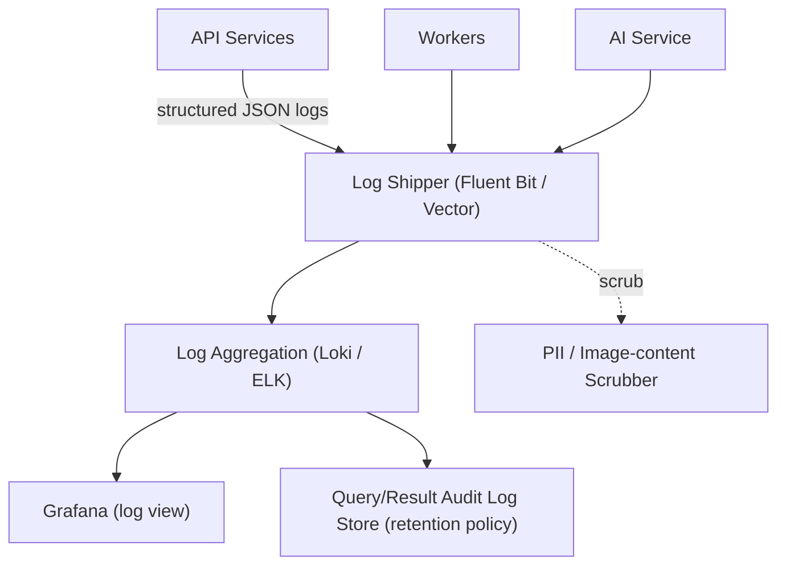

---

## 13. CI/CD

### Responsibilities
- Automated build, test, and deploy pipeline triggered on merge to main and on tagged releases.
- Separate pipelines for: backend services, AI service (model/adapter artifacts), and frontend SPA.
- Staged rollout: CI → automated tests (unit, integration, retrieval-quality regression) → staging deploy → canary production deploy → full production rollout.

### Design decisions
- Podman used in CI runners for rootless, daemonless image builds (no privileged Docker-in-Docker requirement).
- Retrieval-quality regression tests (Recall@K, nDCG against a fixed benchmark set) are a required, automated gate before any embedding-model or reranking-logic change reaches production — a CBIR-specific addition to a standard CI/CD pipeline.
- Canary deployment specifically for the Query Service, with automatic rollback triggered by latency/error-rate regression detected via the monitoring stack.

```mermaid
flowchart LR
    Dev["Developer Commit"] --> PR["Pull Request"]
    PR --> CI["CI Pipeline"]

    subgraph CI["CI Pipeline (Podman-based runners)"]
        Lint["Lint / Static Analysis"]
        UnitTests["Unit Tests"]
        IntegTests["Integration Tests"]
        RetrievalTests["Retrieval-Quality Regression (Recall@K, nDCG)"]
        Build["Build OCI Image (Podman)"]
    end

    Lint --> UnitTests --> IntegTests --> RetrievalTests --> Build
    Build --> Registry["Container Registry"]
    Registry --> Staging["Deploy to Staging"]
    Staging --> StagingTests["Smoke Tests / E2E Tests"]
    StagingTests --> Canary["Canary Deploy (Query Service subset)"]
    Canary --> CanaryCheck{"Latency/Error Regression?"}
    CanaryCheck -->|No| FullRollout["Full Production Rollout"]
    CanaryCheck -->|Yes| Rollback["Automatic Rollback"]
    Rollback --> AlertTeam["Alert Engineering Team"]
```

---

## 14. End-to-End Request Flow (Composite View)

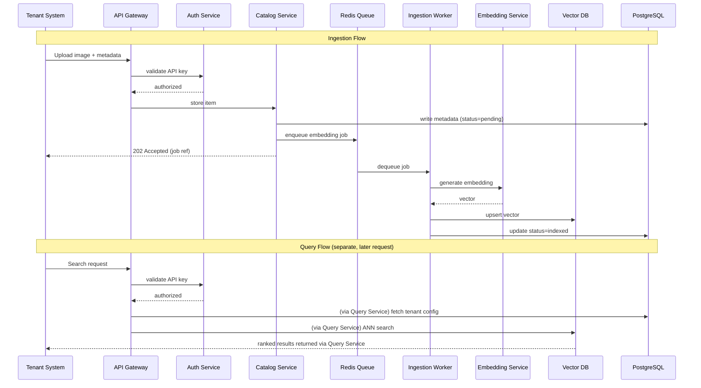

---

## Architecture Summary

| Layer | Primary technology | Scaling strategy |
|---|---|---|
| Frontend | React SPA + CDN | CDN edge caching, stateless |
| Backend API | FastAPI (ASGI) | Horizontal pod autoscaling per service |
| Admin/back-office | Django (optional, separate service) | Low-traffic, minimal scaling needs |
| AI Service | SigLIP 2 + DINOv2, cross-encoder + MLLM reranker | GPU node pool, autoscale on queue depth |
| Relational storage | PostgreSQL + pgvector | Vertical + read replicas; managed service |
| Vector DB | Qdrant → Milvus/Zilliz | Per-tenant collections; migrate at scale threshold |
| Object storage | S3-compatible | Native cloud scaling, lifecycle policies |
| Cache/Queue | Redis Cluster | Horizontal cluster scaling |
| Auth | JWT + API keys, gateway-enforced | Stateless validation, Redis-backed rate limits |
| Deployment | Kubernetes, Podman-built images | Node pool separation (CPU/GPU), canary rollout |
| Monitoring | Prometheus + Grafana + OpenTelemetry | Standard observability stack |
| Logging | Structured JSON + Loki/ELK | Centralized, PII-scrubbed, audit-separated |
| CI/CD | Podman-based pipelines with retrieval-quality gates | Canary + automatic rollback |

This architecture directly implements the NFRs from the PRD: independent scaling of query vs. ingestion vs. AI inference (NFR6), graceful degradation on reranker failure (NFR9), swappable embedding/reranking components (NFR16, NFR17), and cost efficiency through caching and batching (NFR18, NFR19).
